# Documentación Técnica — Crack

> **Versión del documento:** 1.0  
> **Fecha:** Julio 2026  
> **Propósito:** Documentación completa del sistema para desarrolladores y LLM  
> **Basado en:** Código fuente del repositorio (commit actual)

---

# 1. Resumen Ejecutivo

## Objetivo

Crack es un **asistente personal de bolsillo** con IA. Su propósito es permitir al usuario capturar, organizar y recuperar información de forma rápida mediante voz, texto, imágenes y enlaces compartidos. La aplicación procesa cada captura con inteligencia artificial para clasificarla, extraer temas, generar resúmenes y habilitar búsqueda semántica.

## Problema que Resuelve

El flujo tradicional de "apuntar cosas" (abrir app, escribir, etiquetar, guardar) es lento. Crack reduce la fricción a un solo gesto: grabar voz, tomar foto, escribir nota o compartir desde otra app. La IA se encarga de estructurar y organizar el contenido automáticamente.

## Público Objetivo

Usuario único (el propietario). La aplicación está diseñada para uso personal con autenticación mediante email OTP. Solo el email configurado en `OWNER_EMAIL` puede acceder. No existe registro público ni multi-usuario.

## Funcionalidades Principales

- Captura de notas de texto con clasificación IA automática
- Grabación de voz con transcripción (Whisper) y clasificación IA
- Captura de imágenes con clasificación IA (Gemini)
- Recepción de enlaces compartidos desde otras apps (PWA Share Target, iOS Shortcuts)
- Organización visual con 5 pestañas deslizables (Audios, Imágenes, Inicio, Enlaces, Notas)
- Dashboard principal con secciones categorizadas
- Búsqueda híbrida: texto completo (FTS) + semántica (embeddings pgvector)
- Edición, eliminación y reclasificación de items
- Sistema de compartición externa mediante tokens seguros

## Flujo General de Uso

1. El usuario accede a la app (PWA instalada o navegador)
2. Se autentica mediante email OTP (Supabase Auth)
3. Captura contenido mediante:
   - Botón '+' en header → menú (voz, nota, imagen)
   - Compartir desde otra app (Android: share_target, iOS: Shortcuts)
4. La IA procesa y clasifica el contenido automáticamente
5. El contenido aparece en el dashboard y pestañas correspondientes
6. El usuario puede buscar, editar, reclasificar o eliminar items
7. Puede generar un token de API para compartir desde iOS Shortcuts

## Estado Actual del Desarrollo

- Versión: **0.1.0** (pre-release)
- Aplicación funcional en producción
- Framework Next.js 16 (canary)
- Integración con Supabase (Postgres, Auth, Storage, RLS)
- Integración con OpenAI (Whisper, GPT-4o-mini, embeddings)
- Integración con Google Gemini (fallback y clasificación de imágenes)
- PWA completamente funcional

## Nivel de Madurez

**Alpha funcional.** La aplicación es usable pero carece de:
- Tests automatizados (ningún test presente en el código)
- Manejo de errores exhaustivo
- Documentación de API externa
- Sistema de logging/monitoreo
- CI/CD pipeline configurado

---

# 2. Arquitectura General

## Diagrama de Arquitectura

```mermaid
graph TB
    subgraph "Frontend (Next.js)"
        A[Root Layout] --> B[App Layout<br/>(Auth)]
        B --> C[Login Page]
        B --> D[App Shell<br/>(Authenticated)]
        D --> E[Header]
        D --> F[AppPager]
        F --> G[AudioFeed]
        F --> H[GalleryFeed]
        F --> I[DashboardPage]
        F --> J[NoteList<br/>Links]
        F --> K[NoteList<br/>Notes]
        D --> L[CaptureSheet]
        D --> M[SearchModal]
        F --> N[ItemDetail]
        D --> O[ProfileView]
    end

    subgraph "Server Actions"
        P[validateOwnerEmail]
        Q[signOut]
        R[getShareTokenStatus]
        S[generateShareTokenAction]
        T[revokeShareTokenAction]
    end

    subgraph "API Routes"
        U[/api/transcribe]
        V[/api/classify]
        W[/api/classify-image]
        X[/api/search]
        Y[/api/embed]
        Z[/api/share-link]
        AA[/api/link-preview]
        AB[/api/search-events]
        AC[/api/backfill]
        AD[/api/health]
    end

    subgraph "Lib / Services"
        AE[lib/ai.ts]
        AF[lib/openai.ts]
        AG[lib/gemini.ts]
        AH[lib/embedding.ts]
        AI[lib/items.ts]
        AJ[lib/storage.ts]
        AK[lib/share-token.ts]
        AL[lib/link-preview.ts]
        AM[lib/share-link-save.ts]
    end

    subgraph "Supabase"
        AN[Postgres DB]
        AO[Auth Service]
        AP[Storage<br/>crack-files]
        AQ[RLS Policies]
    end

    subgraph "AI Providers"
        AR[OpenAI<br/>Whisper / GPT-4o-mini<br/>text-embedding-3-small]
        AS[Google Gemini<br/>Gemini 2.5 Flash]
    end

    D --> P
    D --> Q
    O --> R
    O --> S
    O --> T
    L --> U
    L --> V
    L --> W
    M --> X
    M --> AB
    N --> V
    N --> AA
    N --> AI
    N --> AJ
    L --> AI
    L --> AJ
    Z --> AI
    Z --> AJ
    Z --> AK
    U --> AE
    V --> AE
    W --> AG
    X --> AH
    Y --> AH
    AE --> AF
    AE --> AG
    AI --> AN
    AJ --> AP
    AK --> AN
    AL --> AN
    AL --> AI
    AM --> AL
    AN --> AQ
    AF --> AR
    AG --> AS
    AH --> AR
```

## Organización por Capas

| Capa | Directorio | Responsabilidad |
|------|-----------|----------------|
| **Presentación** | `app/` | Páginas, layouts, rutas API |
| **Componentes** | `components/` | Componentes React del cliente |
| **Lógica compartida** | `lib/` | Servicios, utilidades, tipos, clientes Supabase |
| **Hooks** | `hooks/` | Custom hooks React |
| **Infraestructura** | `supabase/` | Migraciones DB, config |
| **Estático** | `public/` | Assets, manifest PWA |
| **Configuración** | raíz | next.config, tailwind, eslint, etc. |

## Separación Frontend/Backend

Crack es una aplicación **monolítica** de Next.js (App Router) donde:

- **Frontend:** Componentes React del lado del cliente (`"use client"`) y Server Components
- **Backend:** API Routes (serverless) y Server Actions que ejecutan lógica en el servidor
- **Base de datos:** Supabase Postgres, accedida desde server components, API routes y client components mediante RLS
- **Almacenamiento:** Supabase Storage para archivos multimedia

No existe un backend separado. Todo vive dentro del mismo proyecto Next.js.

## Flujo de Ejecución General

```
Usuario → Interfaz (Componente React)
         → Client Component (useEffect, fetch, onSubmit)
             → API Route (serverless) / Server Action
                 → Lib Service (items.ts, ai.ts, storage.ts)
                     → Supabase SDK / OpenAI SDK / Gemini API
                         → Supabase DB / OpenAI / Gemini
                 → Respuesta
             → Actualización de estado local
         → Re-renderizado
```

## Dependencias Principales

- **Next.js 16.2.9** — Framework full-stack
- **Supabase** — Backend como servicio (DB, Auth, Storage)
- **OpenAI** — Transcripción (Whisper), clasificación (GPT-4o-mini), embeddings
- **Google Gemini** — Fallback para clasificación, transcripción y clasificación de imágenes
- **Tailwind CSS v4** — Estilos utilitarios
- **Lucide React** — Iconografía
- **Zod** — Validación de esquemas
- **date-fns** — Formateo de fechas (locale español)
- **@ducanh2912/next-pwa** — Compilación PWA

---

# 3. Stack Tecnológico

| Tecnología | Versión | Propósito | Dónde se usa |
|-----------|---------|-----------|-------------|
| Next.js | 16.2.9 | Framework web full-stack (App Router) | Toda la aplicación |
| React | 19.2.4 | UI library | Todos los componentes |
| TypeScript | ^5 | Tipado estático | Todo el código fuente |
| Tailwind CSS | ^4 | Framework CSS utilitario | Todos los estilos |
| Supabase JS | 2.108.1 | Cliente Supabase (browser + server) | lib/supabase/*.ts |
| Supabase SSR | 0.12.0 | Manejo de sesiones SSR | lib/supabase/server.ts, middleware |
| OpenAI | 6.42.0 | SDK OpenAI | lib/openai.ts, lib/embedding.ts |
| Google Gemini | (API REST) | Clasificación y transcripción vía API REST | lib/gemini.ts |
| Lucide React | 1.18.0 | Iconos SVG | Components |
| Zod | 4.4.3 | Validación de esquemas | API routes, classify |
| date-fns | 4.4.0 | Formateo de fechas con locale español | Varios componentes |
| clsx | 2.1.1 | Concatenación condicional de clases | lib/utils.ts (cn) |
| tailwind-merge | 3.6.0 | Merge inteligente de clases Tailwind | lib/utils.ts (cn) |
| @ducanh2912/next-pwa | 10.2.9 | Service worker PWA | next.config.ts |
| sharp | 0.35.1 | Procesamiento de imágenes | scripts/generate-icons.js |
| ESLint | ^9 | Linter | eslint.config.mjs |
| PostCSS | ^4 | Postprocesador CSS | postcss.config.mjs |
| Vercel | (hosting) | Despliegue y serverless | Hosting implícito |
| Turbopack | (integrado) | Bundler de desarrollo | next.config.ts |

## Razonamiento de tecnologías

- **Next.js + Vercel:** Plataforma unificada para frontend + API serverless, despliegue sencillo
- **Supabase:** Backend todo-en-uno (DB, Auth, Storage, RLS) con plan gratuito generoso
- **OpenAI Whisper:** Mejor precisión en transcripción de audio en español
- **OpenAI GPT-4o-mini:** Clasificación de contenido rápida y económica
- **Gemini:** Fallback en caso de cuota agotada de OpenAI; clasificación multimodal directa
- **pgvector:** Búsqueda semántica dentro de Postgres, sin servicios externos
- **Zod:** Validación en runtime tanto en servidor como en cliente
- **Tailwind v4:** Sintaxis más moderna con `@import "tailwindcss"` y `@theme inline`

---

# 4. Organización del Proyecto

```
crack/
├── app/                          # Next.js App Router
│   ├── (app)/                    # Route group (rutas autenticadas)
│   │   ├── audio/page.tsx        # Página de audio (renderiza null; contenido via AppPager)
│   │   ├── enlaces/page.tsx      # Página de enlaces (null)
│   │   ├── media/page.tsx        # Página de media (null)
│   │   ├── notes/page.tsx        # Página de notas (null)
│   │   ├── profile/              # Perfil y acciones
│   │   │   ├── page.tsx          # Página de perfil (null)
│   │   │   └── actions.ts        # Server actions: share token management
│   │   ├── layout.tsx            # Layout principal autenticado (header, shell, contexts)
│   │   └── page.tsx              # Página home (null)
│   ├── api/                      # API Routes
│   │   ├── backfill/route.ts     # Batch embeddings
│   │   ├── classify/route.ts     # Clasificación IA de texto
│   │   ├── classify-image/route.ts # Clasificación IA de imagen
│   │   ├── embed/route.ts        # Generar embedding para un item
│   │   ├── health/route.ts       # Health check
│   │   ├── link-preview/route.ts # Obtener Open Graph de URL
│   │   ├── search/route.ts       # Búsqueda híbrida (FTS + semántica)
│   │   ├── search-events/route.ts # Log de eventos de búsqueda
│   │   ├── share-link/route.ts   # API externa para compartir (iOS Shortcuts)
│   │   └── transcribe/route.ts   # Transcripción de audio con Whisper
│   ├── auth/                     # Callbacks de autenticación
│   │   ├── callback/             # Callback OAuth (PKCE + token_hash)
│   │   └── confirm/route.ts      # Confirmación de email (token_hash)
│   ├── login/                    # Página de login
│   │   ├── page.tsx              # Login page
│   │   ├── login-form.tsx        # Formulario de login (email OTP)
│   │   └── actions.ts            # Server actions: validateOwnerEmail, signOut
│   ├── share/page.tsx            # Página share_target (PWA)
│   ├── layout.tsx                # Root layout (fonts, metadata, PWA)
│   ├── globals.css               # Estilos globales, variables CSS, Tailwind
│   └── favicon.ico
│
├── components/                   # Componentes React
│   ├── ui/                       # Componentes UI primitivos
│   │   ├── badge.tsx
│   │   ├── button.tsx
│   │   └── textarea.tsx
│   ├── layout/                   # Componentes de layout
│   │   ├── BottomChrome.tsx      # Barra inferior (tab bar + pager dots)
│   │   ├── BottomNavCard.tsx     # Card de navegación inferior
│   │   ├── PagerDots.tsx         # Indicadores de página
│   │   ├── TabBar.tsx            # Barra de pestañas (5 items)
│   │   ├── TabBarWrapper.tsx     # Portal al body
│   │   ├── TabScrollLayout.tsx   # Layout scrollable con PullToRefresh
│   │   ├── useLayoutAboveTabBar.ts # Hook para layout sobre tab bar
│   │   └── VisualViewportSync.tsx # Sincronización viewport iOS
│   ├── app-modal.tsx             # Sistema de modales estándar
│   ├── app-pager.tsx             # Pager principal (5 pestañas swipeables)
│   ├── app-shell-context.tsx     # Contexto del shell (pager, capture)
│   ├── audio-feed.tsx            # Feed de items de audio
│   ├── audio-item-row.tsx        # Fila de item de audio con waveform
│   ├── capture-menu.tsx          # Menú de selección de captura
│   ├── capture-sheet.tsx         # Modal de captura (voz/nota/imagen)
│   ├── compact-items.tsx         # Componentes compactos (audio/link/note/file)
│   ├── dashboard-modal.tsx       # Modal de dashboard
│   ├── dashboard-page.tsx        # Dashboard principal categorizado
│   ├── fab-button.tsx            # Botón flotante de acción
│   ├── gallery-feed.tsx          # Grid de imágenes
│   ├── home-dashboard.tsx        # Dashboard legacy
│   ├── image-capture.tsx         # Captura de imagen
│   ├── item-card.tsx             # Card de item para listas
│   ├── item-detail.tsx           # Modal de detalle/edición de item
│   ├── item-feed.tsx             # Feed genérico de items
│   ├── link-note-preview.tsx     # Preview de enlace
│   ├── note-capture.tsx          # Captura de nota de texto con auto-clasificación
│   ├── note-list.tsx             # Lista de notas (regular + compacta)
│   ├── pager-panel.tsx           # Wrapper de panel para pager
│   ├── profile-view.tsx          # Vista de perfil/ajustes
│   ├── pull-to-refresh.tsx       # Gesture de pull-to-refresh
│   ├── search-context.tsx        # Contexto de búsqueda
│   ├── search-modal.tsx          # Modal de búsqueda
│   ├── share-sheet.tsx           # Modal de compartir
│   ├── swipe-pager.tsx           # Pager horizontal con gestos
│   ├── swipe-to-delete.tsx       # Gesture de swipe-to-delete
│   ├── url-sync-observer.tsx     # Observer de sincronización URL
│   └── voice-recorder.tsx        # Grabador de voz con transcripción
│
├── hooks/                        # Custom hooks
│   ├── use-item-share.tsx        # Hook para compartir item
│   └── use-long-press.ts         # Hook de long press
│
├── lib/                          # Lógica compartida
│   ├── supabase/                 # Clientes Supabase
│   │   ├── admin.ts              # Cliente admin (service_role)
│   │   ├── client.ts             # Cliente browser
│   │   ├── middleware.ts         # Cliente para middleware
│   │   └── server.ts             # Cliente server component
│   ├── layout/                   # Utilidades de layout
│   │   ├── pull-to-refresh.ts
│   │   └── viewport-chrome.ts
│   ├── ui/                       # Utilidades de UI
│   │   ├── motion.ts             # Constantes de animación iOS
│   │   ├── use-carousel-slide.tsx # Hook de carrusel + dots
│   │   └── use-modal-open.ts     # Hook de estado de modal
│   ├── ai-errors.ts              # Detección de errores de OpenAI
│   ├── ai.ts                     # Orquestación IA (OpenAI → Gemini)
│   ├── auth.ts                   # Validación de owner email
│   ├── embedding.ts              # Embeddings para búsqueda semántica
│   ├── env.ts                    # Validación de config de entorno
│   ├── gemini.ts                 # Integración Google Gemini
│   ├── image-upload.ts           # Flujo de subida de imágenes
│   ├── items.ts                  # CRUD de items
│   ├── link-preview.ts           # Preview de enlaces (OG)
│   ├── openai.ts                 # Integración OpenAI
│   ├── pager-routes.ts           # Configuración de rutas del pager
│   ├── share-link-save.ts        # Guardar enlaces compartidos
│   ├── share-token.ts            # Generación y verificación de tokens
│   ├── share.ts                  # Wrapper Web Share API
│   ├── storage.ts                # Operaciones Supabase Storage
│   ├── types.ts                  # Tipos TypeScript compartidos
│   └── utils.ts                  # Utilidades (cn, formatRelative, etc.)
│
├── supabase/                     # Configuración Supabase
│   └── migrations/               # Migraciones SQL
│       ├── 001_init.sql          # Tabla items + RLS + Storage bucket
│       ├── 002_share_tokens.sql  # Tabla share_tokens
│       ├── 003_search.sql        # FTS, pgvector, search_items_v1 RPC
│       └── 004_fix_search.sql    # Fix tipo float8 en score
│
├── public/                       # Assets estáticos
│   ├── icons/                    # Iconos PWA (192, 512, apple-touch)
│   ├── manifest.json             # Manifest PWA con share_target
│   └── *.svg                     # SVGs varios
│
├── scripts/                      # Scripts de build
│   └── generate-icons.js         # Script para generar iconos PWA
│
├── docs/                         # Documentación
│   └── ios-shortcuts.md          # Guía de iOS Shortcuts
│
├── middleware.ts                 # Next.js middleware (auth check)
├── next.config.ts                # Config Next.js + PWA
├── postcss.config.mjs            # Config PostCSS (Tailwind v4)
├── eslint.config.mjs             # Config ESLint
├── tsconfig.json                 # Config TypeScript
├── package.json                  # Dependencias y scripts
├── .env.example                  # Template de variables de entorno
├── .env.local                    # Variables de entorno locales
├── AGENTS.md                     # Instrucciones para agentes IA
└── CLAUDE.md                     # Instrucciones para Claude
```

## Responsabilidad de Directorios

| Directorio | Responsabilidad |
|-----------|----------------|
| `app/(app)/` | Páginas autenticadas dentro del shell principal. Las páginas individuales (`audio/`, `media/`, `notes/`, `enlaces/`, `profile/`) retornan `null` — el contenido se renderiza via `AppPager` en el layout |
| `app/api/` | API Routes serverless. Gestionan transcripción, clasificación, búsqueda, embbeding, preview de enlaces, share externo, health check y backfill |
| `app/login/` | Página de login con formulario de email OTP |
| `app/share/` | Página de recepción de shared target PWA |
| `components/` | Componentes React organizados por feature. `ui/` para primitivas, `layout/` para componentes estructurales |
| `lib/` | Módulos de servicio reutilizables. Conexiones a Supabase, lógica de negocio, tipos, utilidades |
| `lib/supabase/` | Fábricas de clientes Supabase para distintos contextos (browser, server, admin, middleware) |
| `hooks/` | Custom hooks de React |
| `supabase/migrations/` | Migraciones SQL de la base de datos, aplicadas en orden |
| `public/` | Archivos estáticos servidos por Next.js |
| `scripts/` | Scripts de utilidad para build |

---

# 5. Navegación

## Mapa de Navegación

```
/login                    →   Página de login (email OTP)
  ↓ (autenticación exitosa)
/(app)                    →   Shell principal
  ├── /                   →   Inicio (Dashboard — pestaña central)
  ├── /audio              →   Feed de audios (pestaña izquierda extrema)
  ├── /media              →   Galería de imágenes (pestaña izquierda)
  ├── /enlaces            →   Lista de enlaces (pestaña derecha)
  ├── /notes              →   Lista de notas (pestaña derecha extrema)
  └── /profile            →   Perfil/Ajustes (toggle en header)

/share                    →   Receptor share_target PWA
/auth/callback            →   Callback de autenticación Supabase
/auth/confirm             →   Confirmación de email (token_hash)

API:
/api/transcribe           →   POST: transcripción de audio
/api/classify             →   POST: clasificación de texto
/api/classify-image       →   POST: clasificación de imagen
/api/search               →   GET: búsqueda híbrida
/api/embed                →   POST: generar embedding
/api/search-events        →   POST: log de eventos de búsqueda
/api/share-link           →   GET/POST: API externa de compartir
/api/link-preview         →   GET: preview de URL
/api/health               →   GET: health check
/api/backfill             →   GET: backfill de embeddings
```

## Descripción de Páginas

### `/login`
- **Propósito:** Autenticación del usuario
- **Contenido:** Formulario de email con OTP de 8 dígitos
- **Flujo:** 
  1. Usuario introduce email → Server Action `validateOwnerEmail` verifica que sea `OWNER_EMAIL`
  2. Se envía magic link/OTP via `supabase.auth.signInWithOtp`
  3. Usuario introduce código OTP → `supabase.auth.verifyOtp`
  4. Cooldown de 60s entre envíos (almacenado en localStorage)
- **Componentes:** `LoginForm` (client component)
- **Navegación:** Tras login exitoso → redirección a `/` o `?next=` param

### `/` (Dashboard / Inicio)
- **Propósito:** Página principal de la app autenticada
- **Contenido:** Renderizado por `AppPager` → panel central con `DashboardPage`
- **Componentes:** `AppPager` → `DashboardPage`
- **Nota:** El archivo `page.tsx` retorna `null`. El contenido se inyecta via el layout

### `/audio`
- **Propósito:** Lista de grabaciones de audio
- **Contenido:** `AudioFeed` (feed de items tipo "audio")
- **Componentes:** `AudioFeed` con reproductor inline y waveform

### `/media`
- **Propósito:** Galería de imágenes
- **Contenido:** `GalleryFeed` grid de 5 columnas con miniaturas

### `/enlaces`
- **Propósito:** Lista de enlaces guardados
- **Contenido:** `NoteList` con filtro `filterType="link"`
- **Componentes:** `NoteList` en modo compacto

### `/notes`
- **Propósito:** Lista de notas de texto
- **Contenido:** `NoteList` con filtro `filterType="note"`
- **Componentes:** `NoteList` en modo compacto

### `/share`
- **Propósito:** Página receptora del PWA Share Target
- **Flujo:**
  1. Recibe `url`, `text`, `title` via searchParams
  2. Verifica auth; si no autenticado → redirige a `/login` con `next=/share?...`
  3. Llama a `saveSharedLink()` que extrae URL, obtiene preview OG, y crea item tipo "note"
  4. Redirige a `/notes`

### `/profile`
- **Propósito:** Ajustes de perfil (toggle en header, no navegación directa)
- **Contenido:** `ProfileView` con gestión de share token y cierre de sesión
- **Acciones:** Generar/revocar token de API, copiar URL de API, guía iOS Shortcuts

### `/auth/callback` y `/auth/confirm`
- **Propósito:** Callbacks OAuth y confirmación de email de Supabase Auth
- **Flujo:** Manejan los parámetros `code`, `token_hash` y `type` devueltos por Supabase

## Navegación Interna (App Shell)

La navegación principal es **gestual** mediante swipe horizontal entre 5 pestañas:

```
← swipe ←    [Audio] [Imágenes] [Inicio] [Enlaces] [Notas]    → swipe →
   index 0      index 1    index 2   index 3    index 4
```

La `TabBar` en la parte inferior permite navegación por tap. Los indicadores de página (`PagerDots`) agrupan las 5 pestañas en 3 puntos:
- Punto 0: Audio (0) + Imágenes (1)
- Punto 1: Inicio (2)
- Punto 2: Enlaces (3) + Notas (4)

---

# 6. Diseño Visual

## Estilo General

**Tema oscuro absoluto.** La aplicación utiliza un esquema de color predominantemente negro/gris oscuro con detalles semitransparentes. El estilo evoca una app nativa de iOS con animaciones suaves y gestos táctiles.

## Identidad Visual

- **Nombre:** "Crack" (español coloquial)
- **Descripción:** "Asistente personal de bolsillo"
- **Marca:** Sin logo corporativo; tipografía Geist Sans en bold para el título

## Sistema de Diseño

No existe un design system formal, pero se observan patrones consistentes:

### Colores

| Variable | Valor | Uso |
|----------|-------|-----|
| `--background` | `#09090b` | Fondo principal (zinc-950) |
| `--foreground` | `#fafafa` | Texto principal (zinc-50) |
| `--tm-bg` | `#09090b` | Background app shell |
| `--tm-fg` | `#fafafa` | Foreground app shell |
| `--tm-muted` | `#71717a` | Texto secundario (zinc-500) |
| `--tm-accent` | `#fafafa` | Acento (blanco) |
| `--tm-border` | `rgba(39, 39, 42, 0.8)` | Bordes (zinc-800 con alpha) |

**Temáticas (colores de badges):**

| Tema | Clase |
|------|-------|
| Dev | `bg-emerald-500/20 text-emerald-300 border-emerald-500/30` |
| Marbella | `bg-amber-500/20 text-amber-300 border-amber-500/30` |
| Sport | `bg-sky-500/20 text-sky-300 border-sky-500/30` |
| Politics | `bg-blue-500/20 text-blue-300 border-blue-500/30` |
| Fun | `bg-purple-500/20 text-purple-300 border-purple-500/30` |
| She | `bg-pink-500/20 text-pink-300 border-pink-500/30` |
| Other | `bg-zinc-500/20 text-zinc-300 border-zinc-500/30` |

**Tipos de clasificación (colores de badges):**

| Tipo | Clase |
|------|-------|
| reminder | `bg-amber-500/20 text-amber-300 border-amber-500/30` |
| important | `bg-red-500/20 text-red-300 border-red-500/30` |
| info | `bg-blue-500/20 text-blue-300 border-blue-500/30` |
| note | `bg-zinc-500/20 text-zinc-300 border-zinc-500/30` |

### Tipografías

- **Geist Sans** (variable `--font-geist-sans`): Fuente principal del sistema
- **Geist Mono** (variable `--font-geist-mono`): Fuente monoespaciada (código, etiquetas técnicas)
- Tamaños: `text-xs` (0.75rem), `text-sm` (0.875rem), `text-base` (1rem), `text-lg` (1.125rem)

### Espaciados

- **Gutter:** `clamp(0.75rem, 3.5vw, 1rem)` — variable `--app-gutter`
- **Padding de página:** `px-4`, `py-4`
- **Gap entre secciones:** `gap-4`, `gap-5`
- **Responsive:** Móvil-first, con breakpoints en 768px y 1024px

### Layouts

- **Shell fijo:** Header fijo arriba, bottom chrome fijo abajo, contenido scrollable en medio
- **Header:** Altura `3rem` + padding top `3rem` (área segura) + padding bottom `0.5rem`
- **Bottom Chrome:** `3.5rem` (tab bar) + `1.25rem` (pager dots) = `4.75rem`
- **Modales:** Centrados, con backdrop blur, fondo `zinc-800` y esquinas `rounded-2xl`

### Animaciones

- **Modal enter:** `260ms` con cubic-bezier `(0.32, 0.72, 0, 1)` (iOS ease-out)
- **Modal exit:** `220ms`
- **Page push:** `360ms` con iOS ease-out
- **Swipe pager:** `360ms` transición CSS, rubber band en bordes
- **Modal backdrop:** Blur de 0 a 6px en la animación de entrada
- **Modal card:** Scale de 0.96 a 1 + translateY de 8px a 0

### Iconografía

- Todos los iconos son de **Lucide React**
- Tamaño estándar: `h-5 w-5` (20px), `h-4 w-4` (16px)
- Colores: `text-zinc-400` (neutro), `text-red-500` (microphone), colores según contexto

### Componentes UI Reutilizados

- **Button:** Variantes primary, secondary, ghost, danger
- **Badge:** Colores semitransparentes con borde y texto
- **Textarea:** Estilo `textarea-float` sin bordes, solo línea inferior
- **Input:** `input-float` — estilo "floating input" sin borde completo
- **Select:** `select-float` — estilo consistente con inputs
- **Action ghost:** Botón de lista (`content-row`) con opacidad reducida en active

### Responsive

- **Móvil (<768px):** Diseño principal, full-width, bottom chrome fijo
- **Tablet (768-1024px):** Tab bar más compacto (`3rem` vs `3.5rem`)
- **Desktop (>1024px):** Max-width 960px para el main, 720px para listas, header más grande
- **Safe areas:** Padding superior para notch iOS (`pt-12` en header)
- **Viewport:** `viewport-fit: cover`, `userScalable: false`, `themeColor: #09090b`
- **Touch:** `tap-highlight-color: transparent`, `touch-action: manipulation`

---

# 7. Componentes

## Inventario de Componentes

### Componentes Críticos

| Componente | Archivo | Líneas | Propósito |
|-----------|---------|--------|-----------|
| **AppModal** | `components/app-modal.tsx` | 238 | Sistema de modales estándar con backdrop, animaciones, panel slide |
| **AppPager** | `components/app-pager.tsx` | 138 | Pager principal que orquesta las 5 pestañas y sus feeds |
| **SwipePager** | `components/swipe-pager.tsx` | 375 | Pager gestual horizontal con pointer events, rubber band, animaciones |
| **ItemDetail** | `components/item-detail.tsx` | 626 | Modal de detalle/edición de items con carrusel, preview multimedia, IA |
| **DashboardPage** | `components/dashboard-page.tsx` | 287 | Dashboard principal con secciones categorizadas |
| **VoiceRecorder** | `components/voice-recorder.tsx` | 344 | Grabación, transcripción y clasificación de audio |
| **CaptureSheet** | `components/capture-sheet.tsx` | 160 | Modal de captura que delega en voice/note/image capture |
| **SearchModal** | `components/search-modal.tsx` | 267 | Búsqueda con FTS + semántica, teclado navegable |
| **ProfileView** | `components/profile-view.tsx` | 229 | Gestión de token de API y cierre de sesión |
| **AppShellProvider** | `components/app-shell-context.tsx` | 97 | Contexto global del shell (pager, capture, navegación) |

### Componentes de Layout

| Componente | Archivo | Propósito |
|-----------|---------|-----------|
| **TabBar** | `components/layout/TabBar.tsx` | Barra de navegación inferior con 5 iconos |
| **PagerDots** | `components/layout/PagerDots.tsx` | Indicadores de página (3 puntos) |
| **BottomChrome** | `components/layout/BottomChrome.tsx` | Barra inferior completa (search FAB + dots + tab bar) |
| **BottomNavCard** | `components/layout/BottomNavCard.tsx` | Card contenedor del bottom chrome |
| **TabScrollLayout** | `components/layout/TabScrollLayout.tsx` | Layout scrollable con pull-to-refresh |
| **VisualViewportSync** | `components/layout/VisualViewportSync.tsx` | Sincronización de viewport para iOS PWA |

### Componentes UI

| Componente | Archivo | Props |
|-----------|---------|-------|
| **Button** | `components/ui/button.tsx` | variant (primary/secondary/ghost/danger), disabled |
| **Badge** | `components/ui/badge.tsx` | className (colores via utilidades) |
| **Textarea** | `components/ui/textarea.tsx` | rows, value, onChange, placeholder |

### Componentes de Feed/Lista

| Componente | Archivo | Props principales |
|-----------|---------|------------------|
| **AudioFeed** | `components/audio-feed.tsx` | refreshKey, onSelect |
| **GalleryFeed** | `components/gallery-feed.tsx` | refreshKey, columns, onSelect |
| **NoteList** | `components/note-list.tsx` | refreshKey, filterType, onSelect |
| **ItemFeed** | `components/item-feed.tsx` | items, onSelect (genérico) |
| **AudioItemRow** | `components/audio-item-row.tsx` | item, onSelect |
| **CompactAudioItem** | `components/compact-items.tsx` | item, onClick |
| **CompactLinkItem** | `components/compact-items.tsx` | item, onClick |
| **CompactNoteItem** | `components/compact-items.tsx` | item, onClick |
| **CompactFileItem** | `components/compact-items.tsx` | item, onClick |

### Componentes de Captura

| Componente | Archivo | Propósito |
|-----------|---------|-----------|
| **VoiceRecorder** | `components/voice-recorder.tsx` | Grabación con MediaRecorder, visualización de amplitud, transcripción, clasificación |
| **NoteCapture** | `components/note-capture.tsx` | Editor de texto con auto-guardado y clasificación IA |
| **ImageCapture** | `components/image-capture.tsx` | Captura de imagen (cámara/galería) |
| **CaptureMenu** | `components/capture-menu.tsx` | Menú de selección (voz/nota/imagen) |

### Componentes de Contexto/Estado

| Componente | Archivo | Propósito |
|-----------|---------|-----------|
| **AppShellProvider** | `components/app-shell-context.tsx` | Contexto global del shell de la app |
| **SearchProvider** | `components/search-context.tsx` | Contexto del estado de búsqueda |
| **RefreshContext** | `app/(app)/layout.tsx` | Contexto de refresh (definido inline en el layout) |
| **UrlSyncObserver** | `components/url-sync-observer.tsx` | Sincroniza URL con el índice del pager |

---

# 8. Gestión del Estado

## Estados Locales (useState)

La gran mayoría del estado de la aplicación es local a cada componente. No existe un store global (Redux, Zustand, etc.).

### En App Layout (`app/(app)/layout.tsx`)
- `refreshKey`: Contador de refresco global (bump para recargar feeds)
- `sheetOpen`, `sheetMode`, `sheetKey`: Estado del CaptureSheet
- `showProfile`: Toggle perfil/ajustes
- `uploadError`, `uploading`: Estado de subida de imagen

### En DashboardPage
- `categorized`: Items categorizados por tipo (carga completa)
- `imageUrls`, `audioUrls`: URLs firmadas para multimedia
- `selectedItem`: Item seleccionado para detalle
- `selectedCategory`: Vista de categoría completa

### En SearchModal
- `query`: Texto de búsqueda
- `results`: Resultados de búsqueda
- `selectedIndex`: Índice seleccionado (navegación teclado)
- `searchSource`: Fuente (fts/hybrid/semantic)
- `hasSemantic`: Si hay resultados semánticos

### En VoiceRecorder
- `step`: idle → recording → processing → preview
- `duration`, `amplitude`: Estado de grabación
- `transcript`, `classification`, `title`, `tags`: Resultado del procesamiento

### En ItemDetail
- `mode`: view | edit
- `title`, `content`, `tags`: Campos editables
- `classificationType`, `priority`: Selectores de clasificación
- `mediaUrl`: URL firmada para multimedia
- `saving`, `loadingMedia`: Estados de carga

## Estados Globales (Context)

### AppShellContext (`components/app-shell-context.tsx`)
- **Propósito:** Estado global del shell
- **Valores:**
  - `openCamera`, `openGallery`, `openCapture`, `openCaptureMenu`: Callbacks
  - `pagerIndex`: Índice actual del pager (sincronizado con URL)
  - `setPagerIndex`, `navigateToPage`: Navegación programática
  - `pagerPageCount`: Número total de páginas (5)

### SearchContext (`components/search-context.tsx`)
- **Propósito:** Estado global del modal de búsqueda
- **Valores:** `searchOpen`, `setSearchOpen`, `toggleSearch`

### RefreshContext (definido en `app/(app)/layout.tsx`)
- **Propósito:** Notificar a todos los feeds que recarguen datos
- **Valores:** `refreshKey`, `bumpRefresh`

## Cachés

### Query Embedding Cache (`lib/embedding.ts`)
- **Tipo:** LRU Map en memoria del servidor
- **Capacidad:** 1000 entries
- **TTL:** 30 minutos
- **Propósito:** Cachear embeddings de consultas de búsqueda para evitar llamadas repetidas a OpenAI

## Server State

No existe caché de servidor (React Server Components cache) ni librería de server state (TanStack Query, SWR). Los datos se cargan mediante:
- `useEffect` → `fetch` a API routes
- `useEffect` → llamadas a `lib/items.ts` → Supabase SDK directo

---

# 9. Backend

## Server Actions

Las Server Actions (`"use server"`) son funciones que se ejecutan en el servidor pero se invocan desde el cliente.

### `app/login/actions.ts`

| Acción | Propósito | Flujo |
|--------|-----------|-------|
| `validateOwnerEmail(email)` | Verifica que el email sea `OWNER_EMAIL` | Compara con `getOwnerEmail()`; retorna `{error}` si no coincide |
| `signOut()` | Cierra sesión | Llama a `supabase.auth.signOut()`, redirige a `/login` |

### `app/(app)/profile/actions.ts`

| Acción | Propósito | Flujo |
|--------|-----------|-------|
| `getShareTokenStatus()` | Obtiene estado del token | Consulta `share_tokens` por `user_id`, retorna `{hasToken, lastUsedAt}` |
| `generateShareTokenAction()` | Genera nuevo token | Elimina token existente, crea nuevo con hash SHA-256 + pepper, retorna token plano |
| `revokeShareTokenAction()` | Revoca token | Elimina registro de `share_tokens` por `user_id` |

## API Routes

### `POST /api/transcribe`
- **Input:** FormData con campo `file` (audio, max 25MB)
- **Validación:** Auth, tamaño, tipo MIME (audio/*, video/webm, video/mp4)
- **Proceso:** Llama a `transcribeAudio()` → OpenAI Whisper → Gemini fallback
- **Output:** `{ transcript: string }`
- **Error:** 401 (no auth), 400 (tamaño/tipo), 500 (error)

### `POST /api/classify`
- **Input:** JSON `{ transcript: string }`
- **Validación:** Auth, Zod schema (`z.string().min(1)`)
- **Proceso:** Llama a `classifyTranscript()` → OpenAI GPT-4o-mini → Gemini fallback
- **Output:** `ClassificationResult` (title, type, tags, themes, priority, reminder_date, summary, create_note_from_audio)
- **Error:** 401, 400, 502 (error upstream)

### `POST /api/classify-image`
- **Input:** FormData con file (max 10MB, image types)
- **Proceso:** Llama a `classifyImage()` → Gemini (multimodal, clasificación directa de imagen)
- **Output:** `ClassificationResult`

### `GET /api/search`
- **Input:** Query params `q` (query), `semantic` (boolean opcional)
- **Proceso:** 
  1. Si `semantic=true`, genera embedding de query vía OpenAI
  2. Llama a RPC `search_items_v1` (FTS-only o hybrid según embedding)
  3. Retorna resultados con score RRF
- **Output:** `{ results: SearchResultItem[], search_source, query }`

### `POST /api/embed`
- **Input:** JSON `{ item_id: string }`
- **Proceso:** Obtiene item, genera embedding via OpenAI, guarda en DB
- **Output:** `{ ok: true }`

### `POST /api/search-events`
- **Input:** JSON `{ query, item_id?, position?, clicked? }`
- **Proceso:** Inserta en tabla `search_events`
- **Output:** `{ ok: true }`

### `GET /api/link-preview`
- **Input:** Query param `url`
- **Proceso:** Fetch a la URL, parsea meta tags OG/Twitter/HTML
- **Output:** `{ title, image, description }`
- **Nota:** Usa Discord user-agent para X/Twitter (vía vxtwitter.com)

### `GET + POST /api/share-link`
- **Input:** Token via Bearer header o query param; URL/text/title/imageUrl
- **Proceso:** 
  1. Valida token contra `share_tokens` (timing-safe compare)
  2. Si hay imagen → sube a Storage, clasifica con Gemini, crea item tipo "image"
  3. Si hay URL → llama a `saveSharedLink()`, crea item tipo "note" con preview
- **Output:** `{ ok: true, id }`
- **Auth:** Bearer token (no sesión de usuario)

### `GET /api/backfill`
- **Input:** Query param `offset` (para paginación)
- **Proceso:** Busca items sin embedding, procesa 10 por llamada
- **Output:** `{ processed: number, errors: number }`

### `GET /api/health`
- **Output:** JSON con estado de conexión Supabase, OWNER_EMAIL, SITE_URL

## Servicios (lib/)

### `lib/ai.ts` — Orquestación IA
- `classifyTranscript()`: OpenAI → captura error de cuota → Gemini
- `transcribeAudio()`: OpenAI Whisper → captura error de cuota → Gemini
- `classifyImage()`: Siempre Gemini (OpenAI no tiene soporte multimodal directo)

### `lib/openai.ts` — OpenAI
- `classifyWithOpenAI()`: GPT-4o-mini con `response_format: json_object`
- `transcribeWithOpenAI()`: Whisper-1, language español
- System prompt: Clasificador general en español con temas específicos

### `lib/gemini.ts` — Google Gemini
- `classifyWithGemini()`: Modelos Gemini 2.5 Flash / 3.5 Flash con fallback entre modelos
- `transcribeWithGemini()`: Envío de audio como base64 inline
- `classifyImageWithGemini()`: Envío de imagen como base64 inline
- System prompt: Mismo que OpenAI
- Fallback entre modelos si 404 ("no longer available")

### `lib/embedding.ts` — Embeddings
- `generateEmbedding()`: OpenAI text-embedding-3-small (1536 dimensiones)
- `getQueryEmbedding()`: Con LRU cache (1000 items, 30 min TTL)
- `saveEmbedding()`: Actualiza item en DB con embedding + model name

### `lib/items.ts` — CRUD Items
- `fetchItems()`: Lista items por tipo, ordenados por pin + fecha
- `createItem()`: Inserta nuevo item
- `updateItem()`: Actualiza campos (title, content, metadata, pinned, file_url)
- `deleteItem()`: Elimina item
- `togglePin()`: Cambia estado de pin
- `triggerEmbed()`: Fire-and-forget POST a `/api/embed` (no await)

### `lib/storage.ts` — Supabase Storage
- `uploadFile()`: Sube archivo a `crack-files/{userId}/{folder}/{uuid}.{ext}`
- `getSignedUrl()`: Obtiene URL firmada (1h expiración)
- `deleteFile()`: Elimina archivo

### `lib/share-token.ts` — Tokens de Compartición
- `generateShareToken()`: 32 bytes random en base64url
- `hashShareToken()`: SHA-256 con pepper (env: SHARE_TOKEN_PEPPER)
- `tokensMatch()`: timingSafeEqual para comparación segura

### `lib/link-preview.ts` — Preview de Enlaces
- `fetchLinkPreview()`: Fetch a URL, parsea meta tags OG/Twitter/HTML
- `parseLinkPreviewHtml()`: Regex para extraer title, image, description
- `titleFromUrl()`: Extrae título legible de la URL

## Manejo de Errores

- **API Routes:** Try/catch con logs a console.error, respuestas JSON con códigos HTTP apropiados
- **Server Actions:** Excepciones propagadas al cliente como strings de error
- **AI:** Captura específica de errores de cuota de OpenAI (`ai-errors.ts`) para fallback a Gemini
- **Supabase:** Errores convertidos a mensajes en español via `mapAuthError()` en `env.ts`
- **Formulario de login:** Cooldown de 60s, validación de email, errores mapeados a español

---

# 10. Base de Datos

## Entidades

### Tabla `items`

Entidad principal que almacena todo el contenido capturado.

| Columna | Tipo | Restricciones | Descripción |
|---------|------|---------------|-------------|
| `id` | `uuid` | PK, default `gen_random_uuid()` | Identificador único |
| `type` | `text` | CHECK IN ('note', 'image', 'audio') | Tipo de item |
| `title` | `text` | nullable | Título del item |
| `content` | `text` | nullable | Contenido textual (transcripción, texto de nota, URL) |
| `file_url` | `text` | nullable | Ruta en Storage (para audio e imagen) |
| `metadata` | `jsonb` | default `{}` | Metadatos estructurados |
| `pinned` | `boolean` | default false | Anclado al inicio |
| `created_at` | `timestamptz` | default `now()` | Fecha de creación |
| `user_id` | `uuid` | FK → `auth.users(id)` ON DELETE CASCADE | Propietario |
| `embedding` | `vector(1536)` | nullable | Vector de embedding semántico |
| `embedding_model` | `text` | nullable | Modelo usado para el embedding |
| `fts` | `tsvector` | GENERATED STORED | Vector de texto completo |

**Índices:**
- `items_user_created_idx`: `(user_id, pinned DESC, created_at DESC)` — Query principal de listado
- `items_fts_gin_idx`: GIN index sobre `fts` — Búsqueda de texto completo

**Políticas RLS:**
- 4 políticas (select, insert, update, delete) que verifican `auth.uid() = user_id`

**Estructura de `metadata` (JSONB):**
```json
{
  "themes": ["Dev", "Sport"],
  "tags": ["react", "typescript"],
  "priority": "high",
  "reminder_date": "2026-07-10T14:00:00Z",
  "classification_type": "note",
  "summary": "Nota sobre React Server Components",
  "raw_transcript": "Texto completo transcrito del audio",
  "duration_seconds": 120,
  "link_image": "https://example.com/og-image.jpg",
  "link_title": "Título del enlace (OG)",
  "link_description": "Descripción del enlace (OG)"
}
```

**Tipo `type`:** 'note' | 'image' | 'audio'
- `note`: Notas de texto, enlaces (diferenciados por presencia de URL en content)
- `image`: Imágenes capturadas o compartidas
- `audio`: Grabaciones de voz transcritas
- Nota: `file` como tipo existe en el frontend pero NO en la restricción CHECK de DB (solo 'note', 'image', 'audio')

### Tabla `share_tokens`

| Columna | Tipo | Restricciones | Descripción |
|---------|------|---------------|-------------|
| `id` | `uuid` | PK | Identificador único |
| `user_id` | `uuid` | FK → `auth.users(id)` ON DELETE CASCADE, UNIQUE | Propietario (1 token por usuario) |
| `token_hash` | `text` | NOT NULL, UNIQUE | Hash SHA-256 del token + pepper |
| `created_at` | `timestamptz` | default `now()` | Fecha de creación |
| `last_used_at` | `timestamptz` | nullable | Último uso |

**Índices:**
- `share_tokens_hash_idx`: Sobre `token_hash`
- Constraint unique: `share_tokens_user_id_unique` (1 token por usuario)

**Políticas RLS:**
- 4 políticas (select, insert, update, delete) que verifican `auth.uid() = user_id`
- La API externa usa admin client (bypass RLS)

### Tabla `search_events`

| Columna | Tipo | Restricciones | Descripción |
|---------|------|---------------|-------------|
| `id` | `uuid` | PK | Identificador único |
| `user_id` | `uuid` | FK → `auth.users(id)` ON DELETE CASCADE | Usuario que buscó |
| `query` | `text` | NOT NULL | Texto de la búsqueda |
| `item_id` | `uuid` | FK → `items(id)` ON DELETE SET NULL | Item clickeado |
| `position` | `smallint` | nullable | Posición en resultados (1-based) |
| `clicked` | `boolean` | default false | Si hubo click |
| `created_at` | `timestamptz` | default `now()` | Momento del evento |

**Índices:**
- `search_events_user_idx`: `(user_id, created_at DESC)`
- `search_events_query_idx`: `(user_id, query)`

**Políticas RLS:**
- 2 políticas (select, insert) que verifican `auth.uid() = user_id`

### Extensiones

- `vector` (pgvector) — Embeddings de 1536 dimensiones
- `unaccent` — Normalización de texto para FTS

### FTS Configuration

Configuración personalizada `crack_search`:
```sql
CREATE TEXT SEARCH CONFIGURATION crack_search (COPY = simple);
ALTER TEXT SEARCH CONFIGURATION crack_search
  ALTER MAPPING FOR word, hword, hword_part
  WITH unaccent, simple;
```

- Basada en `simple` (lowercasing, sin stemming agresivo)
- Aplica `unaccent` para búsqueda sin acentos
- La columna `fts` es GENERATED STORED que indexa: title, content, summary, link_title, link_description, raw_transcript

### RPC: `search_items_v1`

Función PL/pgSQL de búsqueda híbrida con Reciprocal Rank Fusion (RRF).

**Parámetros:**
- `p_user_id`: UUID del usuario (filtro de seguridad)
- `p_query`: Texto de búsqueda
- `p_embedding`: Vector(1536) opcional (null = FTS-only)
- `p_limit`: Límite de resultados (default 20)
- `p_rrf_k`: Constante RRF (default 60)

**Algoritmo:**
1. FTS: `websearch_to_tsquery` sobre `crack_search`, rankea con `ts_rank_cd`, top 50
2. Semántico (si embedding proporcionado): Distancia coseno `<=>` con embedding, top 50
3. RRF: Fusión con score = Σ 1/(k + rank_i), top `p_limit`
4. `search_source`: 'fts' | 'semantic' | 'hybrid'

**Seguridad:** `SECURITY DEFINER` con filtro `WHERE user_id = p_user_id`

## Diagrama Entidad-Relación

```mermaid
erDiagram
    auth_users ||--o{ items : owns
    auth_users ||--o{ share_tokens : owns
    auth_users ||--o{ search_events : logs

    items {
        uuid id PK
        text type "note|image|audio"
        text title
        text content
        text file_url
        jsonb metadata
        boolean pinned
        timestamptz created_at
        uuid user_id FK
        vector embedding "1536-dim"
        text embedding_model
        tsvector fts "GENERATED STORED"
    }

    share_tokens {
        uuid id PK
        uuid user_id FK
        text token_hash UNIQUE
        timestamptz created_at
        timestamptz last_used_at
    }

    search_events {
        uuid id PK
        uuid user_id FK
        text query
        uuid item_id FK
        smallint position
        boolean clicked
        timestamptz created_at
    }
```

---

# 11. Flujo de Datos

## Ejemplo 1: Captura de Voz (Audio)

```
Usuario
  │
  ▼
CaptureSheet (AppModal)
  │  Usuario pulsa micrófono en el menú de captura
  │
  ▼
VoiceRecorder
  │  step = "idle" → "recording"
  │  MediaRecorder captura audio en chunks de 250ms
  │  AnalyserNode calcula amplitud para waveform visual
  │
  ▼  Usuario pulsa stop
VoiceRecorder
  │  step = "recording" → "processing"
  │  Blob creado con chunks de audio
  │
  ▼
POST /api/transcribe (FormData)
  │  Auth check (Supabase getUser)
  │  Validación: tamaño < 25MB, tipo audio/*
  │
  ▼
lib/ai.ts → transcribeAudio(file)
  │  OpenAI Whisper (intento principal)
  │  ⚠ Si error de cuota → transcribeWithGemini(file) (fallback)
  │
  ▼
{ transcript: "texto transcrito..." }
  │
  ▼
POST /api/classify { transcript }
  │  Auth check
  │  Zod validation
  │
  ▼
lib/ai.ts → classifyTranscript(transcript)
  │  OpenAI GPT-4o-mini con json_object response_format
  │  ⚠ Si error de cuota → classifyWithGemini(transcript)
  │  System prompt: clasificador español con temas (Dev, Marbella, Sport, Politics, Fun, She, Other)
  │
  ▼
ClassificationResult { title, type, tags, themes, priority, summary, ... }
  │
  ▼
VoiceRecorder (preview)
  │  step = "processing" → "preview"
  │  Usuario puede editar título, tags, transcripción
  │
  ▼  Usuario pulsa "Guardar"
VoiceRecorder → handleSave()
  │  Sube audio a Supabase Storage:
  │    uploadFile(supabase, user.id, "audio", blob, ext)
  │    → path: "{userId}/audio/{uuid}.webm"
  │
  ▼
createItem(supabase, { type:"audio", title, content:transcript, file_url:path, metadata:{...} })
  │  → INSERT en items table
  │  → RLS check: auth.uid() = user_id
  │
  ▼
triggerEmbed(item.id)
  │  → POST /api/embed (fire-and-forget)
  │  → generateItemEmbedding() → saveEmbedding()
  │  → Actualiza embedding y embedding_model en DB
  │
  ▼
Bump refresh → Re-renderizado de feeds → Dashboard actualizado
```

## Ejemplo 2: Búsqueda

```
Usuario
  │  Cmd+K (o tap en search FAB)
  ▼
SearchModal
  │  useEffect: reset state, focus input
  │
  ▼  Usuario escribe "react server components"
SearchModal → handleChange()
  │  Debounce 200ms
  │
  ▼
GET /api/search?q=react+server+components&semantic=false
  │  Auth check
  │  Zod: q max 200 chars
  │
  ▼
supabase.rpc("search_items_v1", { p_user_id, p_query:"react server components", p_limit:25 })
  │  → PL/pgSQL:
  │    websearch_to_tsquery('crack_search', 'react server components')
  │    → fts_ranked: ts_rank_cd() sobre columnas fts
  │    → Como no hay p_embedding → solo FTS
  │    → RRF con single list (solo FTS)
  │
  ▼
SearchResultItem[] (score, search_source="fts")
  │
  ▼
SearchModal renderiza resultados
  │  Usuario navega con ↑↓ o mouse hover
  │
  ▼  400ms después (segunda llamada)
GET /api/search?q=react+server+components&semantic=true
  │
  ▼
getQueryEmbedding("react server components")
  │  → Cache LRU check (miss)
  │  → OpenAI text-embedding-3-small (1536 dim)
  │  → Cache LRU set
  │
  ▼
supabase.rpc("search_items_v1", { p_user_id, p_query, p_embedding, p_limit:25 })
  │  → FTS + semántico + RRF fusion
  │  → search_source = "hybrid"
  │
  ▼
Resultados mejorados con búsqueda semántica
  │
  ▼  Usuario hace Enter o click
SearchModal → logSearchEvent({ query, item_id, position, clicked:true })
  │  → POST /api/search-events → INSERT search_events
  │
  ▼
AppPager → setSelectedItem(item) → ItemDetail modal
```

---

# 12. Autenticación

## Sistema: Supabase Auth con Email OTP

Crack utiliza Supabase Auth con el flujo de **One-Time Password (OTP)** por email. No usa contraseñas.

### Flujo de Login

1. Usuario introduce email en formulario
2. Server Action `validateOwnerEmail()` verifica que coincida con `OWNER_EMAIL`
3. `supabase.auth.signInWithOtp({ email, options: { emailRedirectTo } })` envía email con código
4. Usuario recibe email con código de 8 dígitos
5. `supabase.auth.verifyOtp({ email, token, type: "email" })` verifica el código
6. Sesión establecida → redirección a `/`

### Cooldown

- 60 segundos entre envíos (localStorage `crack-magic-link-cooldown`)
- Email pendiente almacenado en sessionStorage (`crack-pending-email`)

### Logout

Server Action `signOut()`: `supabase.auth.signOut()` → redirección a `/login`

## Middleware (`middleware.ts`)

```typescript
const PUBLIC_PATHS = ["/login", "/auth/callback", "/auth/confirm", "/share"];

// Rutas exentas de auth check:
// - /_next/* (assets)
// - /api/* (API routes)
// - /icons/*
// - /auth/*
// - /manifest.json, /sw.js
// - *.ico, *.png, *.svg, *.js, *.json

// Si no hay usuario y ruta no pública → redirect /login
// Si hay usuario y ruta /login → redirect /
```

## Sesiones

Manejadas por `@supabase/ssr`:
- **Server:** Cookies de sesión vía `createServerClient` en `lib/supabase/server.ts`
- **Middleware:** Cookies vía `createServerClient` en `lib/supabase/middleware.ts`
- **Browser:** Cookies vía `createBrowserClient` en `lib/supabase/client.ts`

## Restricción de Acceso

- Solo el email configurado como `OWNER_EMAIL` puede iniciar sesión
- `OWNER_EMAIL` es una variable de entorno (no modificable desde la UI)
- No existe registro de usuarios, invitaciones ni multi-tenancy

## Protección de Rutas

1. **Middleware:** Verifica sesión en cada request, redirige a `/login` si no autenticado
2. **API Routes:** Cada endpoint verifica `supabase.auth.getUser()` y retorna 401 si no hay usuario (excepto `/api/share-link` que usa Bearer token y `/api/health` que es pública)
3. **Server Actions:** Verifican `supabase.auth.getUser()` internamente
4. **Client Components:** Asumen que el middleware ya filtró; no hay verificación adicional en cliente

---

# 13. APIs

## APIs Externas Consumidas

### OpenAI API

| Endpoint | Uso | Frecuencia | Módulo |
|----------|-----|------------|--------|
| `POST /v1/audio/transcriptions` | Whisper transcripción | Cada grabación de voz | `lib/openai.ts` |
| `POST /v1/chat/completions` | GPT-4o-mini clasificación | Cada item capturado | `lib/openai.ts` |
| `POST /v1/embeddings` | text-embedding-3-small | Cada item guardado + cada búsqueda semántica | `lib/embedding.ts` |

**Errores:** Captura de cuota agotada (429, 402, "insufficient_quota") para fallback a Gemini

### Google Gemini API

| Endpoint | Uso | Frecuencia | Módulo |
|----------|-----|------------|--------|
| `POST /v1beta/models/{model}:generateContent` | Clasificación y transcripción | Fallback de OpenAI + clasificación de imágenes | `lib/gemini.ts` |
| `POST /v1beta/models/{model}:generateContent` | Clasificación de imágenes vía base64 inline | Cada imagen capturada/compartida | `lib/gemini.ts` |

**Fallback entre modelos:** `gemini-2.5-flash` → `gemini-3.5-flash` → `gemini-2.5-flash-lite`

### Supabase API

| Recurso | Uso | Módulo |
|---------|-----|--------|
| `supabase.auth` | Auth OTP, sesiones, getUser | Varios |
| `supabase.from("items")` | CRUD items | `lib/items.ts` |
| `supabase.from("share_tokens")` | CRUD tokens | profile actions |
| `supabase.from("search_events")` | Logs de búsqueda | API search-events |
| `supabase.rpc("search_items_v1")` | Búsqueda híbrida | API search |
| `supabase.storage.from("crack-files")` | Upload, signed URLs, delete | `lib/storage.ts` |

## APIs Propias (REST)

| Ruta | Método | Auth | Propósito |
|------|--------|------|-----------|
| `/api/transcribe` | POST | Sesión | Transcripción audio |
| `/api/classify` | POST | Sesión | Clasificación texto |
| `/api/classify-image` | POST | Sesión | Clasificación imagen |
| `/api/search` | GET | Sesión | Búsqueda híbrida |
| `/api/embed` | POST | Sesión | Generar embedding |
| `/api/search-events` | POST | Sesión | Log eventos búsqueda |
| `/api/link-preview` | GET | Ninguna | Preview OG URL |
| `/api/share-link` | GET/POST | Bearer Token | API externa compartir |
| `/api/backfill` | GET | Sesión | Backfill embeddings |
| `/api/health` | GET | Ninguna | Health check |

---

# 14. Integraciones Externas

## Supabase

**Rol:** Backend principal (base de datos, autenticación, almacenamiento, RLS)

| Componente | Detalle |
|------------|---------|
| **Proyecto** | `ihewprxwxsxvhahtykfq.supabase.co` |
| **Base de datos** | Postgres con pgvector, unaccent |
| **Auth** | Email OTP, sesiones HTTP-only cookies |
| **Storage** | Bucket privado `crack-files` (por carpeta de usuario) |
| **RLS** | Row Level Security en todas las tablas (usuario solo ve sus datos) |
| **Clientes** | Browser (anon key), Server (anon key + cookies), Admin (service_role) |

## OpenAI

**Rol:** IA principal (transcripción Whisper, clasificación GPT-4o-mini, embeddings)

| Componente | Modelo | Propósito |
|------------|--------|-----------|
| **Audio** | `whisper-1` | Transcripción de audio a texto |
| **Chat** | `gpt-4o-mini` | Clasificación de contenido en español |
| **Embeddings** | `text-embedding-3-small` | Embeddings de 1536 dimensiones para búsqueda semántica |

**API Key:** `OPENAI_API_KEY` en variables de entorno

## Google Gemini

**Rol:** IA de respaldo y clasificación multimodal de imágenes

| Modelos | Propósito |
|---------|-----------|
| `gemini-2.5-flash` | Predeterminado |
| `gemini-3.5-flash` | Primer fallback |
| `gemini-2.5-flash-lite` | Segundo fallback |

**API Key:** `GEMINI_API_KEY` en variables de entorno

## Vercel

**Rol:** Hosting y despliegue (implícito, no configurado explícitamente en el código)

---

# 15. Rendimiento

## Comportamiento Observado

### Lazy Loading
- **Imágenes:** Las URL de imágenes se cargan mediante signed URLs de Supabase Storage (expiración 1h)
- **Audio:** Similar, signed URLs para reproducción de audio
- **Items:** Los feeds cargan datos via fetch/useEffect en montaje

### Suspense
- `UrlSyncObserver` envuelto en `<Suspense fallback={null}>` en el layout principal
- `LoginForm` envuelto en `<Suspense fallback={<LoginFallback />}>`

### Debouncing
- **Búsqueda:** 200ms debounce para FTS, 400ms adicionales para búsqueda semántica

### Caché
- **LRU Cache** en servidor para embeddings de consultas (1000 items, 30 min TTL)

### Animaciones
- Animaciones CSS con `will-change: transform` en el pager
- `translate3d` para aceleración GPU en swipe pager
- `backface-visibility: hidden` en bottom chrome

### Optimizaciones Observadas
- `ResizeObserver` en SwipePager para calcular ancho sin reflows constantes
- `pointer-events: none` en elementos inactivos del layout
- Trigger embed como fire-and-forget (`triggerEmbed` con `.catch(() => {})`)
- Signed URLs con expiración en lugar de URLs públicas

---

# 16. Seguridad

## Autenticación
- Supabase Auth con email OTP (sin contraseñas)
- Solo `OWNER_EMAIL` autorizado (validado en Server Action)
- Cooldown de 60s en envío de OTP

## Autorización
- **RLS en Supabase:** Cada tabla tiene políticas que verifican `auth.uid() = user_id`
- **Middleware Next.js:** Redirección a `/login` si no hay sesión
- **API Routes:** Cada endpoint verifica `getUser()` (excepto share-link y health)
- **API Share-Link:** Autenticación via Bearer token con comparación timing-safe (`timingSafeEqual`)

## Validación
- **Input de API:** Zod schemas para validación en runtime
- **Tamaño de archivos:** 25MB max audio, 10MB max imagen
- **Tipos MIME:** Validación de tipos permitidos en uploads
- **Longitud de búsqueda:** Max 200 caracteres

## Sanitización
- No se observa sanitización explícita de HTML (los contenidos se muestran como texto plano)
- Las URLs se validan con `new URL()` antes de fetch externo

## Variables de Entorno / Secretos

| Variable | Propósito | Sensible |
|----------|-----------|----------|
| `NEXT_PUBLIC_SUPABASE_URL` | URL del proyecto Supabase | No (público) |
| `NEXT_PUBLIC_SUPABASE_ANON_KEY` | Anon key Supabase | No (público) |
| `SUPABASE_SERVICE_ROLE_KEY` | Service role key (admin) | **Sí** |
| `OPENAI_API_KEY` | API Key OpenAI | **Sí** |
| `GEMINI_API_KEY` | API Key Google Gemini | **Sí** |
| `OWNER_EMAIL` | Email autorizado | Parcial |
| `NEXT_PUBLIC_SITE_URL` | URL del sitio | No |
| `SHARE_TOKEN_PEPPER` | Pepper para hash de tokens | **Sí** |

## Riesgos de Seguridad Identificados
- `SUPABASE_SERVICE_ROLE_KEY` otorga acceso total a la base de datos (bypass RLS)
- No hay rate limiting explícito en API routes (excepto cooldown de login)
- No hay logging de actividad de administración
- Las signed URLs expiran en 1h pero podrían ser compartidas

---

# 17. Convenciones

## Nomenclatura

- **Archivos:** `kebab-case.ts`, `kebab-case.tsx`
- **Componentes:** PascalCase (`AppModal`, `VoiceRecorder`)
- **Funciones:** camelCase (`fetchItems`, `classifyTranscript`)
- **Variables:** camelCase (`refreshKey`, `searchOpen`)
- **Tipos/Interfaces:** PascalCase (`Item`, `ClassificationResult`, `SearchResultItem`)
- **Archivos de ruta:** `route.ts` para API routes, `page.tsx` para páginas, `layout.tsx` para layouts
- **Base de datos:** snake_case (`user_id`, `created_at`, `file_url`)

## Estructura

- **Componentes planos:** Todos los componentes están en `components/` sin subdirectorios por feature (excepto `ui/` y `layout/`)
- **Archivos de servidor vs cliente:** Componentes cliente marcados con `"use client"` al inicio
- **Server Actions:** Archivos `actions.ts` dentro del directorio de la ruta correspondiente
- **API Routes:** Cada endpoint en su propio directorio `app/api/{nombre}/route.ts`
- **Lógica compartida:** En `lib/`, organizada por dominio (supabase/, ui/, layout/)

## Patrones

### Patrón de Contexto
```typescript
// 1. Crear contexto con valor por defecto
const MyContext = createContext<MyType>(defaultValue);
// 2. Provider component
export function MyProvider({ children }) { ... }
// 3. Hook de acceso
export function useMyContext() { return useContext(MyContext); }
```

### Patrón de API Route
```typescript
export async function POST(request: Request) {
  const supabase = await createClient();
  const { data: { user } } = await supabase.auth.getUser();
  if (!user) return NextResponse.json({ error: "No autenticado" }, { status: 401 });
  try {
    // ... lógica
    return NextResponse.json(result);
  } catch (err) {
    console.error("[endpoint]", err);
    return NextResponse.json({ error: "..." }, { status: 500 });
  }
}
```

### Patrón de Componente Fetch
```typescript
"use client";
export function Component() {
  const [data, setData] = useState(null);
  const [loading, setLoading] = useState(true);
  useEffect(() => {
    async function load() { ... }
    load();
  }, [refreshKey]);
  // render
}
```

## Estilo de Código

- **Sin punto y coma** (omisión generalizada)
- **Comillas dobles** en JSX/TSX
- **Comillas simples** en TypeScript (imports, strings)
- **Async/await** preferido sobre promesas
- **Destructuring** en imports y props
- **Tailwind CSS** clases utilitarias inline (no CSS modules, no styled-components)
- **Variables CSS** para valores dinámicos/temáticos (`--tm-bg`, `--tm-fg`, etc.)
- **Ningún test** presente en el código fuente

---

# 18. Dependencias Internas

## Diagrama de Dependencias entre Módulos

```mermaid
graph TD
    subgraph "UI Layer"
        AppLayout[app/&#40;app&#41;/layout.tsx]
        AppPager[components/app-pager.tsx]
        CaptureSheet[components/capture-sheet.tsx]
        SearchModal[components/search-modal.tsx]
        ItemDetail[components/item-detail.tsx]
        DashboardPage[components/dashboard-page.tsx]
    end

    subgraph "Context / State"
        AppShellContext[components/app-shell-context.tsx]
        SearchContext[components/search-context.tsx]
        RefreshContext[app/&#40;app&#41;/layout.tsx]
    end

    subgraph "Data Layer"
        ItemsService[lib/items.ts]
        StorageService[lib/storage.ts]
        LinkPreviewService[lib/link-preview.ts]
        ShareLinkSave[lib/share-link-save.ts]
    end

    subgraph "AI Layer"
        AIOrch[lib/ai.ts]
        OpenAI[lib/openai.ts]
        Gemini[lib/gemini.ts]
        Embedding[lib/embedding.ts]
    end

    subgraph "Supabase Clients"
        SupabaseClient[lib/supabase/client.ts]
        SupabaseServer[lib/supabase/server.ts]
        SupabaseAdmin[lib/supabase/admin.ts]
        SupabaseMiddleware[lib/supabase/middleware.ts]
    end

    subgraph "API Routes"
        APITranscribe[app/api/transcribe/route.ts]
        APIClassify[app/api/classify/route.ts]
        APISearch[app/api/search/route.ts]
        APIEmbed[app/api/embed/route.ts]
        APIShareLink[app/api/share-link/route.ts]
    end

    subgraph "Auth"
        LoginActions[app/login/actions.ts]
        ProfileActions[app/&#40;app&#41;/profile/actions.ts]
        AuthHelper[lib/auth.ts]
        Middleware[middleware.ts]
    end

    AppLayout --> AppShellContext
    AppLayout --> SearchContext
    AppLayout --> CaptureSheet
    AppLayout --> AppPager

    AppPager --> AppShellContext
    AppPager --> SearchContext
    AppPager --> DashboardPage
    AppPager --> ItemDetail
    AppPager --> SearchModal

    CaptureSheet --> AppShellContext
    
    ItemDetail --> ItemsService
    ItemDetail --> StorageService
    ItemDetail --> LinkPreviewService

    DashboardPage --> ItemsService
    DashboardPage --> StorageService

    SearchModal --> Embedding

    ItemsService --> SupabaseClient
    StorageService --> SupabaseClient

    ShareLinkSave --> ItemsService
    ShareLinkSave --> LinkPreviewService

    APITranscribe --> AIOrch
    APITranscribe --> SupabaseServer
    APIClassify --> AIOrch
    APIClassify --> SupabaseServer
    APISearch --> Embedding
    APISearch --> SupabaseServer
    APIEmbed --> Embedding
    APIEmbed --> SupabaseServer
    APIShareLink --> SupabaseAdmin
    APIShareLink --> StorageService
    APIShareLink --> ItemsService
    APIShareLink --> AIOrch

    AIOrch --> OpenAI
    AIOrch --> Gemini

    LoginActions --> AuthHelper
    LoginActions --> SupabaseServer
    ProfileActions --> SupabaseServer

    Middleware --> SupabaseMiddleware
```



## Dependencias Críticas

1. **AppLayout ← AppShellContext → AppPager → DashboardPage/ItemDetail/SearchModal**: El núcleo de la UI. Si AppShellContext falla, toda la navegación colapsa.

2. **CaptureSheet → VoiceRecorder/NoteCapture → AI Pipeline**: El flujo de captura depende de la cadena completa: grabación → transcripción → clasificación → guardado.

3. **ItemsService + StorageService**: Toda operación de datos pasa por estos dos módulos. Son el punto único de acceso a Supabase.

4. **AIOrch → OpenAI → Gemini**: La orquestación de IA con fallback es crítica para la funcionalidad de clasificación.

5. **APIShareLink → SupabaseAdmin + AIOrch**: La API externa usa el cliente admin (bypass RLS) y la IA de clasificación de imágenes.

---

# 19. Flujo Completo de una Funcionalidad

## Funcionalidad: Captura y Clasificación de Imagen

### Paso a Paso

#### 1. Usuario → Interfaz
El usuario pulsa el botón "+" en el header de la aplicación.

#### 2. Interfaz → Componente
```typescript
// app/(app)/layout.tsx
<button onClick={openCaptureMenu}>
  <Plus />
</button>
```
`openCaptureMenu()` establece `sheetMode = "menu"` y `sheetOpen = true`.

#### 3. CaptureSheet (menú)
```typescript
// components/capture-sheet.tsx
<button onClick={() => handleMenuSelect("image")}>
  <Camera />
</button>
```
Usuario selecciona "image". Se muestra opción de cámara o galería.

#### 4. CaptureSheet → AppShellContext (openGallery)
```typescript
// capture-sheet.tsx - pickImage()
onOpenChange(false);
openGallery();
```

#### 5. App Layout → Input file
```typescript
// app/(app)/layout.tsx
<input ref={galleryInputRef} type="file" accept="image/*" className="hidden"
  onChange={(e) => handleImageSelected(e, "gallery")} />
```

#### 6. handleImageSelected → uploadImageFromFile
```typescript
// app/(app)/layout.tsx
async function handleImageSelected(e, _source) {
  const file = e.target.files?.[0];
  await uploadImageFromFile(file);
  bumpRefresh();
  router.push("/media");
}
```

#### 7. uploadImageFromFile (lib)
```typescript
// lib/image-upload.ts
export async function uploadImageFromFile(file: File): Promise<void> {
  const supabase = createClient();                          // ← Cliente Supabase browser
  const { data: { user } } = await supabase.auth.getUser(); // ← Auth check

  const path = await uploadFile(supabase, user.id, "images", file, ext);
  // → supabase.storage.from("crack-files").upload(path, file)
  // → Ruta: {userId}/images/{uuid}.jpg

  const item = await createItem(supabase, {
    type: "image",
    title: file.name.replace(/\.[^.]+$/, "") || "Imagen",
    file_url: path,
    user_id: user.id,
    metadata: {},
  });
  // → INSERT INTO items (type, title, file_url, user_id, metadata)
  // → RLS: auth.uid() = user_id

  triggerEmbed(item.id);
  // → POST /api/embed (fire-and-forget)
}
```

#### 8. triggerEmbed → API Embed (fire-and-forget)
```typescript
// lib/items.ts
export function triggerEmbed(itemId: string): void {
  fetch("/api/embed", {
    method: "POST",
    headers: { "Content-Type": "application/json" },
    body: JSON.stringify({ item_id: itemId }),
  }).catch(() => {});
}
```

#### 9. POST /api/embed
```typescript
// app/api/embed/route.ts
export async function POST(request: Request) {
  // Auth check
  // Zod validation: { item_id: z.string().uuid() }
  // fetch item from DB
  // generateItemEmbedding(item)
  //   → buildEmbeddingText(item): concatena title, content, summary, tags, transcript
  //   → OpenAI embeddings: text-embedding-3-small
  // saveEmbedding(supabase, itemId, embedding)
  //   → UPDATE items SET embedding = [...], embedding_model = 'text-embedding-3-small'
}
```

#### 10. Redirección a /media
```typescript
router.push("/media");
```

#### 11. GalleryFeed carga las imágenes
```typescript
// components/gallery-feed.tsx
useEffect(() => {
  const supabase = createClient();
  const images = await fetchItems(supabase, "image");
  // → SELECT * FROM items WHERE type = 'image' ORDER BY pinned DESC, created_at DESC
  // → RLS: auth.uid() = user_id
  
  // Para cada imagen, obtener signed URL de Storage
  const urls = await Promise.all(
    images.map(i => getSignedUrl(supabase, i.file_url))
    // → supabase.storage.from("crack-files").createSignedUrl(path, 3600)
  );
  setImageUrls(urls);
}, [refreshKey]);
```

#### 12. Renderizado
GalleryFeed renderiza el grid de 5 columnas con miniaturas clickeables.

#### 13. Usuario puede ver detalle
Tap en imagen → `setSelectedItem(item)` → AppPager renderiza `ItemDetail`:
- Carga signed URL de la imagen
- Muestra imagen a tamaño completo
- Botón de edición permite reclasificar con IA o manualmente
- Botón de share usando Web Share API
- Botón de eliminar (con confirmación)

---

# 20. Inventario Técnico

## Páginas

| Ruta | Archivo | Tipo | Propósito |
|------|---------|------|-----------|
| `/` | `app/(app)/page.tsx` | Server | Home (null; contenido via AppPager) |
| `/audio` | `app/(app)/audio/page.tsx` | Server | Audio feed (null) |
| `/media` | `app/(app)/media/page.tsx` | Server | Gallery feed (null) |
| `/enlaces` | `app/(app)/enlaces/page.tsx` | Server | Links list (null) |
| `/notes` | `app/(app)/notes/page.tsx` | Server | Notes list (null) |
| `/profile` | `app/(app)/profile/page.tsx` | Server | Profile (null) |
| `/login` | `app/login/page.tsx` | Server | Login form |
| `/share` | `app/share/page.tsx` | Server | PWA share target |
| `/auth/callback` | `app/auth/callback/route.ts` | Route | Auth callback |
| `/auth/confirm` | `app/auth/confirm/route.ts` | Route | Email confirmation |

## Componentes

| Componente | Archivo | Líneas | Dependencias Clave |
|-----------|---------|--------|-------------------|
| AppModal | `components/app-modal.tsx` | 238 | - |
| AppPager | `components/app-pager.tsx` | 138 | SwipePager, PagerPanel, DashboardPage, NoteList, GalleryFeed, AudioFeed |
| SwipePager | `components/swipe-pager.tsx` | 375 | - |
| CaptureSheet | `components/capture-sheet.tsx` | 160 | AppModal, VoiceRecorder, NoteCapture |
| DashboardPage | `components/dashboard-page.tsx` | 287 | CompactItems, ItemDetail, lib/items, lib/storage |
| ItemDetail | `components/item-detail.tsx` | 626 | AppModal, Badge, Textarea, lib/items, lib/storage |
| VoiceRecorder | `components/voice-recorder.tsx` | 344 | Button, Textarea, Badge, lib/items, lib/storage |
| SearchModal | `components/search-modal.tsx` | 267 | - |
| AudioFeed | `components/audio-feed.tsx` | - | AudioItemRow |
| GalleryFeed | `components/gallery-feed.tsx` | - | - |
| NoteList | `components/note-list.tsx` | - | CompactItems |
| ProfileView | `components/profile-view.tsx` | 229 | Profile actions |
| TabBar | `components/layout/TabBar.tsx` | 52 | AppShellContext |
| BottomChrome | `components/layout/BottomChrome.tsx` | 34 | TabBar, PagerDots, SearchContext |
| AppShellProvider | `components/app-shell-context.tsx` | 97 | Pager routes |
| SearchProvider | `components/search-context.tsx` | 33 | - |

## Hooks

| Hook | Archivo | Propósito |
|------|---------|-----------|
| `useAppShell()` | `components/app-shell-context.tsx` | Acceder al contexto del shell |
| `usePager()` | `components/app-shell-context.tsx` | Acceder solo al estado del pager |
| `useSearch()` | `components/search-context.tsx` | Acceder al estado de búsqueda |
| `useRefreshKey()` | `app/(app)/layout.tsx` | Obtener refresh key actual |
| `useBumpRefresh()` | `app/(app)/layout.tsx` | Forzar recarga de feeds |
| `useModalOpen()` | `lib/ui/use-modal-open.ts` | Gestionar estado del modal (setAttribute data-modal-open) |
| `useCarouselSlide()` | `lib/ui/use-carousel-slide.tsx` | Carrusel de items con swipe |
| `useLongPress()` | `hooks/use-long-press.ts` | Gesture de long press |
| `useItemShare()` | `hooks/use-item-share.tsx` | Compartir item (renderiza ShareSheet) |
| `useLayoutAboveTabBar()` | `components/layout/useLayoutAboveTabBar.ts` | Calcular altura disponible sobre tab bar |

## Server Actions

| Acción | Archivo | Propósito |
|--------|---------|-----------|
| `validateOwnerEmail()` | `app/login/actions.ts` | Verificar email autorizado |
| `signOut()` | `app/login/actions.ts` | Cerrar sesión |
| `getShareTokenStatus()` | `app/(app)/profile/actions.ts` | Obtener estado del token |
| `generateShareTokenAction()` | `app/(app)/profile/actions.ts` | Generar nuevo token |
| `revokeShareTokenAction()` | `app/(app)/profile/actions.ts` | Revocar token |

## Servicios (lib/)

| Módulo | Funciones Clave |
|--------|----------------|
| `lib/items.ts` | fetchItems, createItem, updateItem, deleteItem, togglePin, triggerEmbed |
| `lib/storage.ts` | uploadFile, getSignedUrl, deleteFile |
| `lib/ai.ts` | classifyTranscript, transcribeAudio, classifyImage |
| `lib/openai.ts` | classifyWithOpenAI, transcribeWithOpenAI |
| `lib/gemini.ts` | classifyWithGemini, transcribeWithGemini, classifyImageWithGemini |
| `lib/embedding.ts` | generateEmbedding, getQueryEmbedding, saveEmbedding, updateItemEmbedding |
| `lib/ai-errors.ts` | isOpenAIQuotaError |
| `lib/share-token.ts` | generateShareToken, hashShareToken, tokensMatch |
| `lib/link-preview.ts` | fetchLinkPreview, parseLinkPreviewHtml, titleFromUrl |
| `lib/share-link-save.ts` | saveSharedLink, resolveSharedUrl, resolveSharedTitle |
| `lib/image-upload.ts` | uploadImageFromFile |
| `lib/auth.ts` | getOwnerEmail, isOwnerEmail |
| `lib/env.ts` | getSupabasePublicConfig, mapAuthError |
| `lib/utils.ts` | cn, formatRelative, classificationLabel, classificationColor, priorityLabel, formatDuration, extractFirstUrl, getNoteUrl |

## Tipos (lib/types.ts)

| Tipo | Descripción |
|------|-------------|
| `ItemType` | 'note' \| 'image' \| 'audio' \| 'file' |
| `ClassificationType` | 'note' \| 'reminder' \| 'important' \| 'info' |
| `Priority` | 'high' \| 'medium' \| 'low' |
| `Theme` | 'Dev' \| 'Marbella' \| 'Sport' \| 'Politics' \| 'Fun' \| 'She' \| 'Other' |
| `ItemMetadata` | Metadatos del item (themes, tags, priority, etc.) |
| `Item` | Item completo |
| `ClassificationResult` | Resultado de clasificación IA |
| `SearchSource` | 'fts' \| 'semantic' \| 'hybrid' |
| `SearchResultItem` | Item con score y search_source |
| `SearchResponse` | Respuesta de búsqueda |

---

# 21. Riesgos Técnicos

## Riesgos Detectados

### 1. Ausencia Total de Tests
No existe ningún test (unit, integration, e2e) en el repositorio. Cualquier cambio en lib/, API routes o componentes debe validarse manualmente.

### 2. Archivos de Componentes Grandes
- `item-detail.tsx`: 626 líneas — mezcla lógica de edición, visualización, carrusel, preview multimedia, sharing
- `swipe-pager.tsx`: 375 líneas — lógica de gestos compleja con pointer events
- `voice-recorder.tsx`: 344 líneas — toda la lógica de grabación, transcripción, clasificación, guardado

### 3. Mezcla de Responsabilidades en Componentes
- `DashboardPage` carga datos (fetchItems), gestiona estado (categorized, imageUrls), renderiza UI, y contiene sub-componentes inline
- `ItemDetail` maneja vista, edición, carrusel, preview de enlaces, preview de media, AI reclassification

### 4. Duplicidad de Lógica de IA
Los system prompts de OpenAI y Gemini se duplican casi idénticos en `lib/openai.ts` y `lib/gemini.ts`. Un cambio en los temas o reglas requiere modificar ambos archivos.

### 5. Fire-and-Forget sin Monitoreo
`triggerEmbed()` es fire-and-forget: no hay logging de errores, reintentos, ni cola de procesamiento. Si falla, el item no tiene embedding y no es recuperable mediante búsqueda semántica.

### 6. Cache LRU sin Persistencia
El cache de embeddings de consultas (`embedding.ts`) es en memoria del servidor serverless. En Vercel (funciones serverless efímeras), cada invocación puede empezar con cache vacío.

### 7. Signed URLs Sin Refresh
Las signed URLs de Storage expiran en 1h. Si el usuario mantiene el item-detail abierto más de 1h, la URL caduca y la imagen/audio no se carga. No hay mecanismo de refresh automático.

### 8. Sin Rate Limiting en API Routes
No hay protección contra abuso en endpoints como `/api/search`, `/api/transcribe`, `/api/classify`. Un usuario malicioso podría consumir cuota de OpenAI rápidamente.

### 9. Dependencia de OpenAI para Funcionalidad Core
Sin OpenAI, la clasificación y transcripción dependen de Gemini como fallback. Sin Gemini (y sin OpenAI), la clasificación de imágenes falla directamente.

### 10. Manejo de Errores Inconsistente
- API routes retornan errores JSON con códigos HTTP
- lib/ items.ts lanza excepciones con mensajes en español
- Componentes capturan errores con `alert()` o silenciosamente con `catch(() => {})`
- No hay un sistema de notificación de errores unificado

### 11. Sin Gestión de Estado de Red
No hay detección de conectividad, cola de operaciones offline, ni sincronización post-conexión (aunque la app es PWA).

---

# 22. Glosario

| Término | Definición |
|---------|-----------|
| **Item** | Entidad principal. Un contenido capturado: nota, imagen, audio, enlace o archivo |
| **Captura** | Acción de crear un nuevo item (voz, texto, imagen, compartir) |
| **Clasificación** | Proceso IA que determina tipo (nota/recordatorio/importante/info), temas, tags, prioridad y resumen |
| **Transcripción** | Conversión de audio a texto mediante Whisper o Gemini |
| **Embedding** | Vector numérico de 1536 dimensiones que representa semánticamente un texto |
| **FTS** | Full-Text Search — búsqueda por palabras clave usando tsvector de Postgres |
| **RRF** | Reciprocal Rank Fusion — algoritmo de fusión de rankings para combinar FTS y búsqueda semántica |
| **pgvector** | Extensión de Postgres para almacenamiento y búsqueda de vectores |
| **crack_search** | Configuración personalizada de FTS que usa unaccent + simple |
| **Owner** | Único usuario autorizado de la aplicación (definido por OWNER_EMAIL) |
| **Share Token** | Token de seguridad para la API externa de compartir (iOS Shortcuts) |
| **PWA** | Progressive Web App — aplicación instalable con service worker |
| **Signed URL** | URL temporalmente válida para acceder a archivos privados en Storage |
| **Service Role** | Rol de Supabase con permisos de administración (bypass RLS) |
| **Panel Slide** | Transición animada entre dos vistas dentro de un modal (usado en carrusel) |
| **Pager Dots** | Indicadores visuales de la página actual (3 puntos para 5 pestañas) |

---

# 23. Contexto para futuros LLM

## Resumen del Proyecto

Crack es un asistente personal de bolsillo con IA, implementado como una PWA monolítica con Next.js 16.2.9 (App Router), Supabase (Postgres, Auth, Storage, RLS), OpenAI (Whisper, GPT-4o-mini, text-embedding-3-small) y Google Gemini como fallback.

### Qué Hace

Permite capturar información mediante:
1. **Notas de texto** con clasificación IA automática (título, tipo, temas, tags, prioridad, resumen)
2. **Grabaciones de voz** que se transcriben (Whisper) y clasifican
3. **Imágenes** que se clasifican mediante Gemini (multimodal)
4. **Enlaces compartidos** desde el PWA Share Target de Android o mediante iOS Shortcuts via API

Todo el contenido se organiza automáticamente y es recuperable mediante búsqueda híbrida (texto completo + semántica vectorial con pgvector).

### Arquitectura

**Monolito Next.js** con server actions, API routes y client components. No hay backend separado.

```
Capa UI → Capa de Componentes → API Routes / Lib Services → Supabase / OpenAI / Gemini
```

### Estructura del Proyecto

- **`app/`** — Páginas (App Router), API routes, layouts
- **`components/`** — Componentes React (client components)
- **`lib/`** — Lógica compartida: servicios Supabase, IA, utilidades, tipos
- **`supabase/migrations/`** — 4 migraciones SQL (items, share_tokens, search)
- **`middleware.ts`** — Auth check en cada request

### Navegación

5 pestañas navegables por swipe horizontal: Audio → Imágenes → Inicio → Enlaces → Notas. El dashboard central (Inicio) muestra secciones categorizadas. Cada pestaña tiene su propia ruta (`/audio`, `/media`, `/`, `/enlaces`, `/notes`).

La navegación se gestiona mediante `AppShellContext` que sincroniza el índice del pager con la URL usando `router.replace()`.

### Flujo de Datos

1. **Captura:** Componente → API route → OpenAI/Gemini → Supabase (items table + storage)
2. **Búsqueda:** SearchModal → `/api/search` → RPC `search_items_v1` (FTS + pgvector con RRF)
3. **Visualización:** Componente → `fetchItems()` → Supabase (con RLS) → render
4. **Compartir externo:** iOS Shortcuts → `GET /api/share-link?token=...&url=...` → Supabase Admin

### Base de Datos (Postgres + pgvector)

- **`items`**: Tabla principal (type: note|image|audio, con columna tsvector GENERATED y embedding vector(1536))
- **`share_tokens`**: Tokens hash para API externa (1 por usuario)
- **`search_events`**: Logs de clics en búsqueda
- **RLS**: Todas las tablas con políticas de usuario propietario
- **RPC `search_items_v1`**: Búsqueda híbrida con FTS + vector + RRF fusion

### Componentes Principales

- **AppModal**: Sistema de modales con backdrop blur y animaciones iOS
- **SwipePager**: Pager horizontal gestual con pointer events, rubber band, depth transform
- **AppPager**: Orquesta las 5 pestañas y sus feeds
- **ItemDetail**: Modal de detalle/edición con carrusel, AI reclassification, preview multimedia
- **VoiceRecorder**: Grabación con MediaRecorder, waveform, transcripción + clasificación
- **CaptureSheet**: Modal de captura que delega en voz/texto/imagen
- **SearchModal**: Búsqueda con debounce, keyboard navigation, FTS + semántica
- **DashboardPage**: Dashboard categorizado con 5 secciones

### Autenticación

Supabase Auth con email OTP. Solo `OWNER_EMAIL` autorizado. Middleware protege todas las rutas excepto login y auth callbacks. API routes verifican sesión en cada request.

### Diseño Visual

Tema oscuro absoluto (`#09090b`), tipografía Geist Sans, iconos Lucide React. Animaciones con cubic-bezier iOS. Diseño mobile-first con responsive hasta 960px desktop. Los modales usan backdrop blur y animación de escala + translate.

### Tecnologías Clave

- **Framework:** Next.js 16.2.9 (canary) con Turbopack
- **Lenguaje:** TypeScript 5
- **CSS:** Tailwind CSS v4 (PostCSS, `@import "tailwindcss"`)
- **Base de datos:** Supabase Postgres + pgvector
- **IA:** OpenAI (Whisper, GPT-4o-mini, text-embedding-3-small) + Google Gemini (fallback)
- **Auth:** Supabase Auth (email OTP)
- **Storage:** Supabase Storage (bucket privado)
- **PWA:** @ducanh2912/next-pwa + manifest.json con share_target
- **Hosting:** Vercel (implícito)

### Convenciones importantes

- "use client" explícito en componentes cliente
- Server Actions en archivos `actions.ts` dentro de cada ruta
- API Routes en `app/api/{nombre}/route.ts`
- Lógica compartida en `lib/`
- Componentes sin subdirectorios por feature (excepto ui/ y layout/)
- Variables CSS para valores dinámicos del layout (`--tm-bg`, `--tm-fg`, etc.)
- Español como idioma de UI, errores y comentarios
- Sin tests en el código base
- Sin punto y coma, comillas dobles en JSX, comillas simples en TS
- El state management es local (useState) + context (AppShellContext, SearchContext, RefreshContext)
- No existe store global (Redux, Zustand, etc.)

### Integraciones

- **Supabase**: DB, Auth, Storage, RLS (clientes: browser, server, admin, middleware)
- **OpenAI**: Whisper (transcripción), GPT-4o-mini (clasificación), text-embedding-3-small (embeddings 1536d)
- **Google Gemini**: Fallback para clasificación y transcripción; clasificación directa de imágenes
- **PWA**: Service worker, manifest con share_target, apple-touch-icon, viewport-fit: cover

### Patrones detectados

1. Context Provider + Hook pattern para estado global
2. API Route pattern: auth check → validation → try/catch → response
3. Component pattern: useState + useEffect + fetch → loading state → render
4. AI fallback pattern: try OpenAI → catch quota error → Gemini
5. Fire-and-forget pattern: triggerEmbed (embedding generado asíncronamente)

### Riesgos conocidos

- 0% cobertura de tests
- Componentes grandes (>300 líneas) que mezclan responsabilidades
- System prompts duplicados entre OpenAI y Gemini
- Embedding fire-and-forget sin monitoreo
- Cache LRU efímero en entorno serverless
- Sin rate limiting en API routes
- Dependencia crítica de OpenAI para funcionalidad core
- Manejo de errores inconsistente (alert, console.error, catch silencioso)

---

*Documento generado a partir del análisis exhaustivo del código fuente del repositorio `crack`, Julio 2026.*
